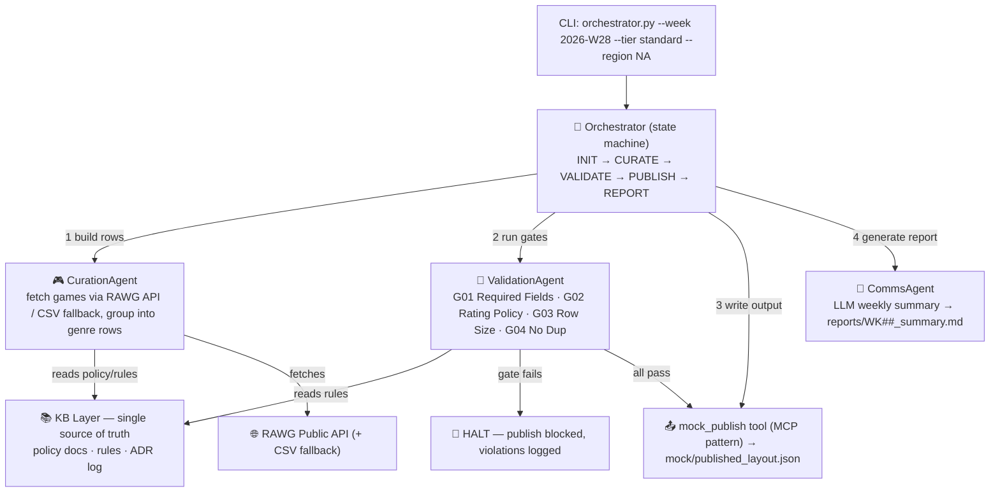

 


# multi-agent-content-ops

A production-grade multi-agent pipeline for weekly game content curation.
Built with **Python · Anthropic SDK · RAWG API · MCP-style tools.**

This repo demonstrates the architecture patterns behind a real-world automated
content-operations system — rebuilt from scratch on public data sources and a
fictional platform called **NexCurate**. No proprietary code.

## The Problem

A game streaming platform publishes weekly content rows to millions of devices
across multiple regions and audience tiers. Doing this manually means:

- Hours of catalog research and row assembly every week
- No systematic guardrails — bad data ships to production
- No audit trail of why content decisions were made
- Comms work (summaries, reports) done by hand after every build

This pipeline automates the entire cycle — **fetch → curate → validate →
publish → report** — so a human only reviews the final output and approves.

## Architecture



### Agent Roles

| Agent | Responsibility |
|-------|----------------|
| **Orchestrator** | State machine. Drives stage transitions. Never does domain work itself. |
| **CurationAgent** | Fetches games via the catalog tool, groups them into genre rows per KB row rules. Deterministic — no LLM. |
| **ValidationAgent** | Runs G01–G04 gates. Returns `publish_blocked=True` on any failure. Pipeline halts immediately. |
| **CommsAgent** | Receives run stats from the orchestrator. LLM writes the weekly narrative (deterministic template fallback offline). Writes `reports/` markdown. |

## Validation Gates

| Gate | Rule |
|------|------|
| **G01** | Required fields present (`id`, `title`, `genre`, `rating`) |
| **G02** | Rating policy per tier (e.g. casual blocks M/AO) |
| **G03** | Row size policy (3–10 titles per row) |
| **G04** | No duplicate titles (intra-row + cross-row) |

Gates are **fail-fast**: the first failure halts the pipeline before publish and
prints a violation report. Rules are pulled from the KB at runtime — policy
changes need no code change or deploy.

## Reliability Layer

Beyond the structural gates, the pipeline treats the LLM boundary as a
production surface:

- **Typed boundary (`models.py`)** — frozen `Title` dataclass + `Rating` enum;
  ESRB full names from the live API are normalized to canonical codes at the
  catalog boundary, so malformed entries fail at construction with a precise
  error instead of surfacing at the gates (which still re-check as defense in
  depth).
- **Evals (`evals/run_evals.py`)** — the gates check structured rows; the eval
  harness checks the *LLM's own output*. A deterministic judge verifies the
  weekly report has the required sections and that its stated counts match the
  input (catching hallucinated numbers), plus an optional LLM-as-judge for
  faithfulness. Runs offline; wired into CI to block regressions.
- **Observability (`obs/telemetry.py`)** — every run records per-stage latency,
  token usage, and cost, and writes a JSON trace. The per-model cost table is
  what a routing decision (Haiku vs. larger model) would key off.
- **Guardrails (`guardrails.py`)** — free-text narrative is scrubbed for PII
  (emails, phone numbers) and flagged terms before it leaves the pipeline.
- **Failure modes** — LLM calls retry with backoff and degrade to deterministic
  offline behavior; `LLMAgent.safe_json` validates model JSON against required
  keys and returns `None` rather than crashing on malformed output.

## File Tree

```
multi-agent-content-ops/
├── orchestrator.py          # state machine + CLI
├── models.py                # typed domain objects — Title + Rating
├── agents/
│   ├── base.py              # deterministic KB base + LLM-capable subclass (retry/offline)
│   ├── curation_agent.py    # fetch + group into rows
│   ├── validation_agent.py  # runs the gates
│   └── comms_agent.py       # weekly narrative report
├── gates/
│   └── validation_gates.py  # G01–G04, fail-fast, ValidationReport
├── tools/
│   ├── game_catalog.py      # RAWG + CSV fallback
│   └── mock_publish.py      # MCP-style publish tool (mock CMS)
├── obs/
│   └── telemetry.py         # per-stage latency, token usage, cost, run trace
├── evals/
│   ├── run_evals.py         # gate-behavior + comms-quality + optional LLM judge
│   └── golden/              # good/bad layout fixtures
├── guardrails.py            # PII redaction + blocklist on free-text output
├── kb/                      # single source of truth
│   ├── domain/              # content_policy, row_rules, platform_tiers
│   └── decisions/           # ADR log
├── data/synthetic_games.csv # 30-title offline fallback catalog
├── tests/
│   ├── test_gates.py        # 13 gate unit tests
│   ├── test_models.py       # 7 typed-boundary tests (Rating normalization, Title validation)
│   └── test_extras.py       # guardrails, telemetry, JSON failure-mode
└── reports/                 # generated weekly summaries
```

## Quickstart

```bash
pip install -r requirements.txt          # optional; core runs stdlib-only
cp .env.example .env                      # optional; add keys for live LLM/RAWG

# Full pipeline (offline-safe: uses synthetic CSV + deterministic report if no keys)
python orchestrator.py --week 2026-W28 --tier standard --region NA

# Dry-run: validate only, publish nothing
python orchestrator.py --week 2026-W28 --tier casual --dry-run

# Tests + evals (no API keys needed)
python tests/test_gates.py
python tests/test_models.py
python tests/test_extras.py
python evals/run_evals.py
```

## Example Output

```
[17:40:02] INIT      → CURATE
[17:40:02] CURATE    built 5 rows, 30 titles
[17:40:02] CURATE    → VALIDATE
[17:40:02] VALIDATE  all gates passed
[17:40:02] VALIDATE  → PUBLISH
[17:40:02] PUBLISH   → REPORT
[17:40:02] REPORT    → DONE

PIPELINE ✅ SUCCESS
{ "success": true, "rows_published": 5, "titles_total": 30, ... }
```

## Tech Stack

| Layer | Technology |
|-------|------------|
| LLM | Anthropic Claude (claude-3-5-haiku) |
| Game data | RAWG Public API / synthetic CSV |
| Validation | Pure-Python rule engine |
| Orchestration | State-machine orchestrator, no framework lock-in |

## Extending

- **Connect a real CMS:** replace the body of `tools/mock_publish.py::publish()`
  with your API call. Agent contracts are unchanged.
- **Add a gate:** write a `g05_*` function in `gates/validation_gates.py` and
  add it to the `GATES` list.
- **Add an agent:** subclass `BaseAgent` (or `LLMAgent` if it needs the model),
  implement `run(context) -> ...`, register it in `orchestrator.py`.
- **Adjust a tier's rating policy:** edit `kb/domain/content_policy.md` — no
  code change. Adding a *new* tier currently also requires updating the CLI
  tier choices in `orchestrator.py` (making the KB fully authoritative is
  tracked in `REFACTOR.md` R3).

See `PLAN.md` for the build log and roadmap.
